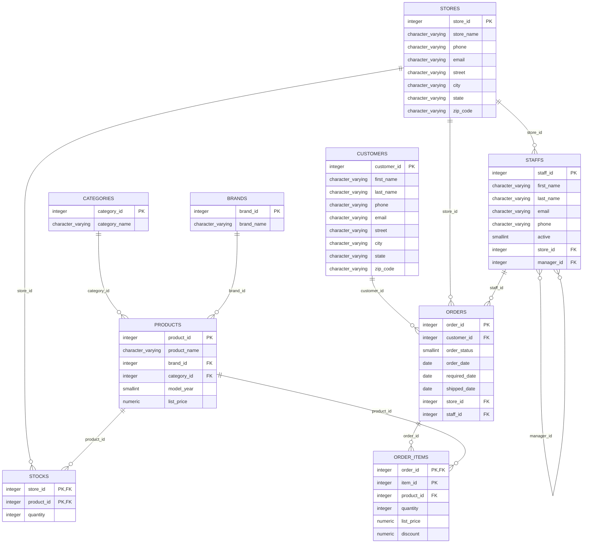

# Bikestore Schema Documentation

## 1. Business Context Overview

The `bikestore` schema represents a comprehensive transactional database system designed to manage the operations of a bicycle retail business. It covers various aspects of the business, from product management and inventory to sales and customer relations. The schema facilitates tracking of:

*   **Products**: Details about bicycles and accessories, including their categories, brands, model years, and list prices.
*   **Brands & Categories**: Classification of products to organize inventory and sales.
*   **Stores & Staff**: Information about physical store locations and the staff members employed at each store, including their reporting structures.
*   **Customers**: Records of individual customers, their contact details, and addresses.
*   **Orders**: Detailed records of customer purchases, including order dates, statuses, and associated staff and stores.
*   **Order Items**: The specific products included in each order, their quantities, prices, and any applied discounts.
*   **Stocks**: Inventory levels of each product at different store locations.

This database schema supports essential business processes such as sales order processing, inventory management, customer relationship management, and staff administration, providing a foundational structure for business intelligence and operational reporting.

## 2. Entity Relationship Diagram (ERD)

Below is an Entity-Relationship Diagram (ERD) illustrating the tables within the `bikestore` schema and their relationships.

## 3. Table Breakdown with Key Columns and Statistics

This section provides a detailed look at each table, including column definitions, primary/foreign keys, and noteworthy statistical observations from the analyzed data.

---

### Table: `categories`

Stores information about different product categories.

*   **Primary Keys**: `category_id`
*   **Foreign Keys**: None

| Column Name     | Data Type         | Nullable | Notes                                                              |
| :-------------- | :---------------- | :------- | :----------------------------------------------------------------- |
| `category_id`   | `integer`         | NO       | Primary Key. No missing values.                                    |
| `category_name` | `character varying` | NO       | No missing values. High entropy (`2.81`) indicates diverse category names, suggesting a good range of product classifications. |

---

### Table: `products`

Contains details about individual bicycle products.

*   **Primary Keys**: `product_id`
*   **Foreign Keys**:
    *   `brand_id` references `brands.brand_id`
    *   `category_id` references `categories.category_id`

| Column Name    | Data Type         | Nullable | Notes                                                              |
| :------------- | :---------------- | :------- | :----------------------------------------------------------------- |
| `product_id`   | `integer`         | NO       | Primary Key. No missing values.                                    |
| `product_name` | `character varying` | NO       | No missing values. High entropy (`8.14`) suggests unique and varied product names. |
| `brand_id`     | `integer`         | NO       | Foreign Key. No missing values.                                    |
| `category_id`  | `integer`         | NO       | Foreign Key. No missing values.                                    |
| `model_year`   | `smallint`        | NO       | No missing values.                                                 |
| `list_price`   | `numeric`         | NO       | No missing values. **6 outliers detected**, indicating a few products have significantly different list prices compared to the rest. This could be due to premium items or specialized products. |

---

### Table: `brands`

Lists all bicycle brands available.

*   **Primary Keys**: `brand_id`
*   **Foreign Keys**: None

| Column Name  | Data Type         | Nullable | Notes                                                              |
| :----------- | :---------------- | :------- | :----------------------------------------------------------------- |
| `brand_id`   | `integer`         | NO       | Primary Key. No missing values.                                    |
| `brand_name` | `character varying` | NO       | No missing values. High entropy (`3.17`) indicates a good variety of brand names. |

---

### Table: `stores`

Information about the physical store locations.

*   **Primary Keys**: `store_id`
*   **Foreign Keys**: None

| Column Name | Data Type         | Nullable | Notes                           |
| :---------- | :---------------- | :------- | :------------------------------ |
| `store_id`  | `integer`         | NO       | Primary Key. No missing values. |
| `store_name` | `character varying` | NO       | No missing values.              |
| `phone`     | `character varying` | YES      | No missing values.              |
| `email`     | `character varying` | YES      | No missing values.              |
| `street`    | `character varying` | YES      | No missing values.              |
| `city`      | `character varying` | YES      | No missing values.              |
| `state`     | `character varying` | YES      | No missing values.              |
| `zip_code`  | `character varying` | YES      | No missing values.              |

---

### Table: `staffs`

Details about the employees at each store.

*   **Primary Keys**: `staff_id`
*   **Foreign Keys**:
    *   `store_id` references `stores.store_id`
    *   `manager_id` references `staffs.staff_id` (self-referencing for reporting hierarchy)

| Column Name | Data Type         | Nullable | Notes                                                              |
| :---------- | :---------------- | :------- | :----------------------------------------------------------------- |
| `staff_id`  | `integer`         | NO       | Primary Key. No missing values.                                    |
| `first_name` | `character varying` | NO       | No missing values.                                                 |
| `last_name` | `character varying` | NO       | No missing values.                                                 |
| `email`     | `character varying` | NO       | No missing values.                                                 |
| `phone`     | `character varying` | YES      | No missing values.                                                 |
| `active`    | `smallint`        | NO       | No missing values. Indicates staff activity status.                |
| `store_id`  | `integer`         | NO       | Foreign Key. No missing values.                                    |
| `manager_id` | `integer`         | YES      | Foreign Key (self-referencing). **10.0% missing values**, which is expected as top-level managers would not have a manager_id. |

---

### Table: `customers`

Information about registered customers.

*   **Primary Keys**: `customer_id`
*   **Foreign Keys**: None

| Column Name   | Data Type         | Nullable | Notes                                                              |
| :------------ | :---------------- | :------- | :----------------------------------------------------------------- |
| `customer_id` | `integer`         | NO       | Primary Key. No missing values.                                    |
| `first_name`  | `character varying` | NO       | No missing values. High entropy (`9.78`) suggests a wide variety of first names. |
| `last_name`   | `character varying` | NO       | No missing values. High entropy (`9.14`) suggests a wide variety of last names. |
| `phone`       | `character varying` | YES      | **87.0% missing values**, indicating that phone numbers are frequently not collected or recorded for customers. This is a significant data gap if phone contact is critical. |
| `email`       | `character varying` | NO       | No missing values. Very high entropy (`9.97`) suggests unique email addresses for most customers. |
| `street`      | `character varying` | YES      | No missing values. Very high entropy (`9.97`) suggests diverse street addresses. |
| `city`        | `character varying` | YES      | No missing values. High entropy (`7.42`) indicates customers from a varied set of cities. |
| `state`       | `character varying` | YES      | No missing values. Low entropy (`1.17`) suggests customers are predominantly located in a few specific states. |
| `zip_code`    | `character varying` | YES      | No missing values. High entropy (`7.42`) indicates a diverse set of zip codes. |

---

### Table: `orders`

Records of all customer orders.

*   **Primary Keys**: `order_id`
*   **Foreign Keys**:
    *   `customer_id` references `customers.customer_id`
    *   `store_id` references `stores.store_id`
    *   `staff_id` references `staffs.staff_id`

| Column Name     | Data Type         | Nullable | Notes                                                              |
| :-------------- | :---------------- | :------- | :----------------------------------------------------------------- |
| `order_id`      | `integer`         | NO       | Primary Key. No missing values.                                    |
| `customer_id`   | `integer`         | YES      | Foreign Key. While nullable by schema, statistics show **0.0% missing values**, meaning all orders are associated with a customer. |
| `order_status`  | `smallint`        | NO       | No missing values. **23 outliers detected**, suggesting some order statuses are rare or represent unusual states. Further investigation into these specific status codes is recommended. |
| `order_date`    | `date`            | NO       | No missing values.                                                 |
| `required_date` | `date`            | NO       | No missing values.                                                 |
| `shipped_date`  | `date`            | YES      | **2.3% missing values**, indicating a small percentage of orders are either not yet shipped or their shipping date was not recorded. |
| `store_id`      | `integer`         | NO       | Foreign Key. No missing values.                                    |
| `staff_id`      | `integer`         | NO       | Foreign Key. No missing values.                                    |

---

### Table: `order_items`

Details of products included in each order.

*   **Primary Keys**: (`order_id`, `item_id`)
*   **Foreign Keys**:
    *   `order_id` references `orders.order_id`
    *   `product_id` references `products.product_id`

| Column Name  | Data Type         | Nullable | Notes                                                              |
| :----------- | :---------------- | :------- | :----------------------------------------------------------------- |
| `order_id`   | `integer`         | NO       | Part of Composite Primary Key, Foreign Key. No missing values.     |
| `item_id`    | `integer`         | NO       | Part of Composite Primary Key. No missing values.                  |
| `product_id` | `integer`         | NO       | Foreign Key. No missing values.                                    |
| `quantity`   | `integer`         | NO       | No missing values.                                                 |
| `list_price` | `numeric`         | NO       | No missing values. **44 outliers detected**, suggesting a notable number of order items have list prices significantly different from the average. This could be due to high-value items, special offers, or data entry variations. |
| `discount`   | `numeric`         | NO       | No missing values.                                                 |

---

### Table: `stocks`

Current inventory levels for products at each store.

*   **Primary Keys**: (`store_id`, `product_id`)
*   **Foreign Keys**:
    *   `store_id` references `stores.store_id`
    *   `product_id` references `products.product_id`

| Column Name  | Data Type         | Nullable | Notes                                                              |
| :----------- | :---------------- | :------- | :----------------------------------------------------------------- |
| `store_id`   | `integer`         | NO       | Part of Composite Primary Key, Foreign Key. No missing values.     |
| `product_id` | `integer`         | NO       | Part of Composite Primary Key, Foreign Key. No missing values.     |
| `quantity`   | `integer`         | YES      | While nullable by schema, statistics show **0.0% missing values**, meaning all stock entries have a recorded quantity, which is good for inventory tracking. |