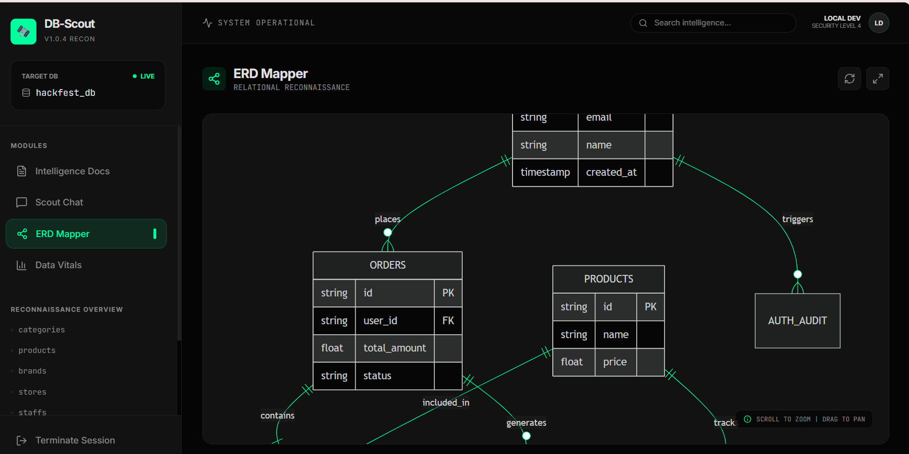

# DB-Scout Frontend

A modern React + TypeScript web application for intelligent database reconnaissance and analysis.

## Overview

DB-Scout is an AI-powered tool that connects to your databases, generates intelligent documentation, and provides interactive RAG-based chat insights. Built with Vite, React, TailwindCSS, and Framer Motion for a responsive, cyberpunk-themed user experience.
### SS:




## Features

- 🔍 **Database Connection** – Test and validate database connections
- 📊 **Schema Analysis** – Run agentic Scout analysis on database schemas
- 📄 **Intelligence Docs** – Auto-generated markdown documentation from GCS
- 💬 **RAG Chat** – Interactive Q&A powered by retrieval-augmented generation
- 📈 **Data Vitals** – Real-time metrics and system health monitoring
- ERD Visualization – Entity relationship diagrams and schema mapping

## Prerequisites

- Node.js 16+
- npm or yarn

## Installation & Setup

1. Install dependencies:
   ```bash
   npm install
   ```

2. Configure environment variables in `.env.local`:
   ```
   VITE_API_URL=http://localhost:8000
   VITE_API_BASE_URL=/api
   ```

3. Start the development server:
   ```bash
   npm run dev
   ```

   The app will be available at `http://localhost:5173`

## Project Structure

```
src/
├── api.ts               # API client for backend communication
├── config.ts            # Configuration and environment setup
├── store.ts             # Zustand store for global state
├── App.tsx              # Main app component
├── Gateway.tsx          # Database connection gateway
├── Scouting.tsx         # Analysis initiation interface
├── components/
│   ├── Dashboard.tsx    # Main dashboard view
│   ├── DataVitals.tsx   # Metrics and monitoring
│   ├── ERDMapper.tsx    # Schema visualization
│   ├── IntelligenceDocs.tsx # Auto-generated docs display
│   └── ScoutChat.tsx    # RAG-based chat interface
```

## Build & Deployment

Build the project for production:
```bash
npm run build
```

Preview the production build locally:
```bash
npm run preview
```
