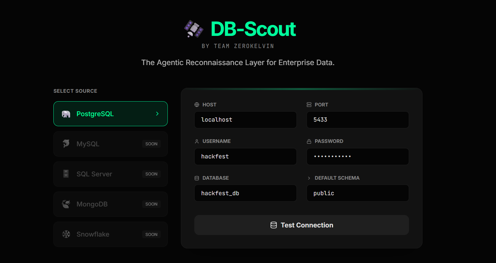
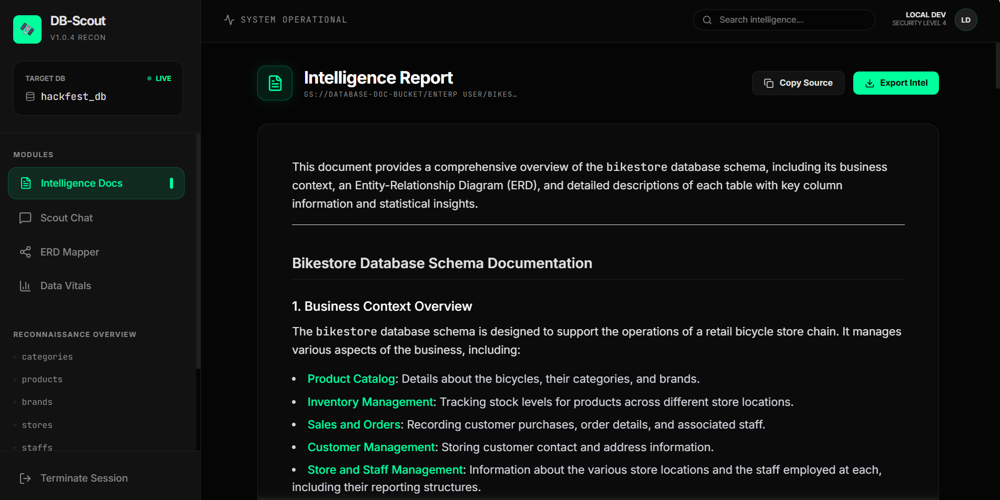
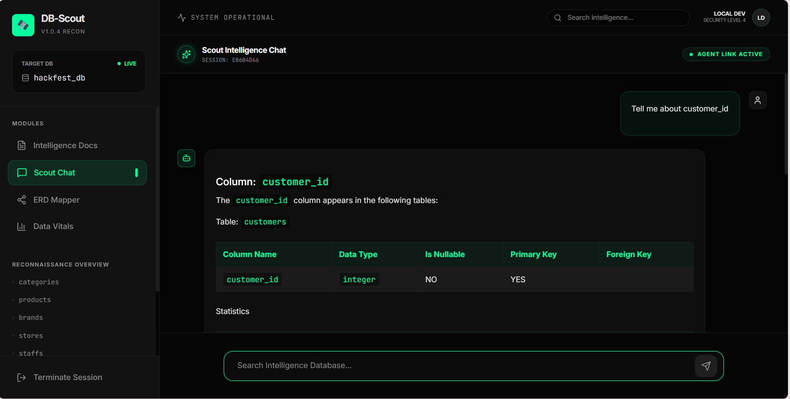
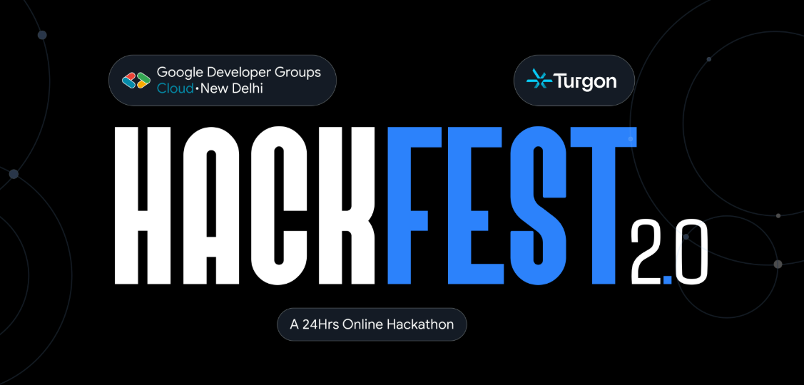
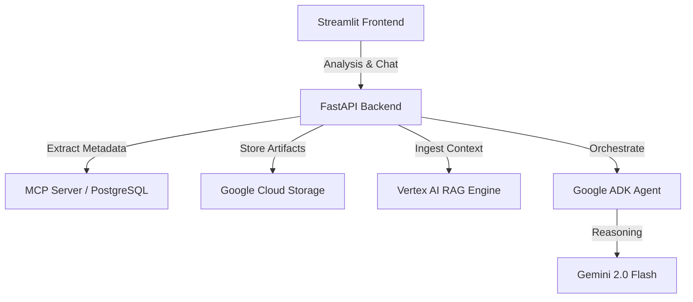

# 🛰️ DB-Scout

**The Intelligent Data Dictionary & Agentic Reconnaissance Layer**

DB-Scout transforms legacy databases into searchable knowledge bases. By leveraging the **Model Context Protocol (MCP)** and **Vertex AI RAG Engine**, it autonomously scouts legacy databases, maps hidden relationships, and provides deep statistical intelligence—all while keeping your data private and secure.

Propesed Solution :


Final UI: 




Built for HackFest 2.0



## 🚀 Core Pillars

**Standardized Recon (MCP Bridge):** Uses **FastMCP** to establish a secure, standardized bridge to SQL Server, PostgreSQL, and Snowflake, exposing schemas directly to the LLM.

**Agentic RAG (Vertex AI):** Leverages **Vertex AI RAG Engine** and **Google ADK** to provide a conversational interface that understands your database's unique context and business logic.

**Deep Intel (Statistical Engine):** Calculates Z-Scores for outlier detection, Shannon Entropy for data diversity, and completeness metrics to assess data health.

**Zero-Trust Security:** A local-first transport layer and Read-Only enforcement ensure database credentials and PII never leave your private environment.

## 📊 System Architecture



## 🛠️ Tech Stack

| Component | Technology |
| :--- | :--- |
| **Orchestration** | **LangGraph** & Google ADK |
| **AI Engine** | **Vertex AI** (Gemini 2.0 Flash) |
| **RAG Layer** | **Vertex AI RAG Engine** |
| **Connectivity** | **FastMCP** (Model Context Protocol) |
| **Backend** | **FastAPI** (Python 3.10+) |
| **Frontend** | **Streamlit** |
| **Storage** | **Google Cloud Storage (GCS)** |
| **Database** | PostgreSQL (Dockerized) |

## Repository Structure

- **`/backend`**: FastAPI application, LangGraph agents, and MCP server logic.
  - `/src`: Core API and RAG utilities.
  - `/agents`: LangGraph workflow definitions and Gemini wrappers.
  - `/tests`: MCP connectivity and API test suites.
- **`/interface`**: Streamlit-based "Scout Command Center" for natural language interrogation.
- **`/Doc`**: Detailed architecture, setup guides, and system narratives.
- **`/logs`**: Structured JSON logs for agent activities and API runs.

## 🛠️ Quick Start

### 1. Environment Setup
```bash
# Create and activate environment
python -m venv venv
source venv/bin/activate  # Windows: venv\Scripts\activate

# Install dependencies
pip install -r requirements.txt
```

### 2. Configure the Mission
Create a `.env` file with your database credentials (stored locally and securely):
```
DB_TYPE=postgresql
DB_HOST=localhost
DB_PORT=5432
# DB-Scout uses these to build the local MCP bridge
```

### 3. Launch the Command Center
```bash
# Run the Scout Interface
streamlit run interface/app.py
```

## 📊 The "Scout" Analysis Workflow

**Ingestion:** Connects via MCP and extracts INFORMATION_SCHEMA.

**Profiling:** Samples 1,000 rows to calculate statistical "vitals."

**Mapping:** Generates Mermaid.js relationship diagrams.

**Reporting:** Produces AI-enhanced business summaries for every entity.

## 🛡️ Security & Privacy

**Read-Only Enforcement:** Code-level restrictions prevent any UPDATE/DELETE operations.

**Privacy-First RAG:** Raw data stays in the DB; only metadata and statistical samples are shared with the LLM to generate business context.

---

**Team Zero Kelvin** | GDG Cloud New Delhi × Turgon HackFest 2.0

See `AGENTS.md` for detailed agent guidelines and logging conventions.
