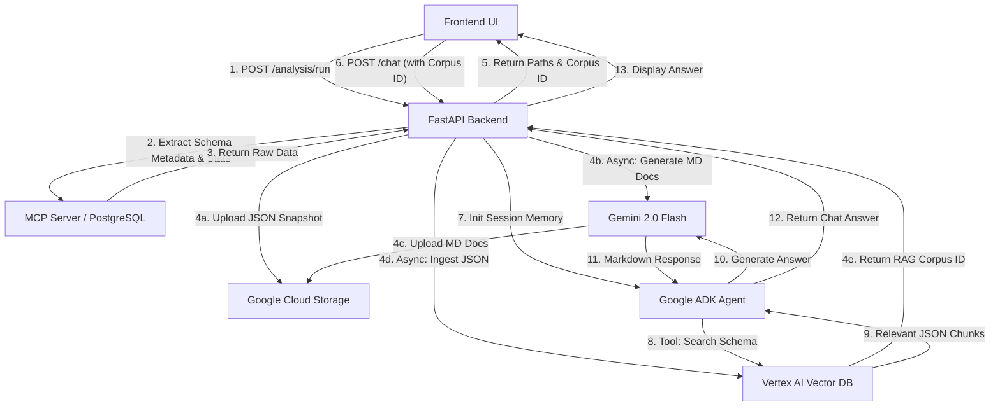

# Intelligent Data Dictionary: Backend Architecture & Integration Guide

This document outlines the architecture, data flow, API endpoints, and frontend integration steps for the Intelligent Data Dictionary backend. The system leverages FastAPI, PostgreSQL, Google Cloud Storage (GCS), Vertex AI (RAG Engine), and the Google Agent Development Kit (ADK).

## 📊 High‑Level Architecture Flow



## 💻 Frontend Client Integration Guide

To build a seamless frontend application (e.g., using React, Next.js, or Vue), the client should follow this operational sequence:

### Phase 1: Connection & Onboarding

1.  **Validate Database (Optional):** If your UI allows users to input their own DB credentials, hit `POST /database/test`. This verifies the connection before proceeding.
2.  **Trigger Analysis:** Once connected (or using a default schema), call `POST /analysis/run`.
3.  **Crucial Step:** The frontend must capture and persist the `rag_corpus_id` returned in the response. This is the unique identifier for this specific user's database memory.
    *   **Tip:** Store this in React Context, Redux, or LocalStorage.

### Phase 2: Rendering the Dashboard

1.  **Show Previews:** Use the `preview_tables` array returned from the analysis endpoint to populate a sidebar or table directory.
2.  **Fetch Documentation:** Download and render the generated Markdown documentation using the `md_gcs_path`.
    *   **Note:** Ensure your GCS bucket supports Signed URLs or Public read access.

### Phase 3: Conversational Agent (Chat UI)

1.  **Session Management:** Generate a unique `session_id` (UUID recommended) when the user opens chat. Reuse this ID throughout the conversation to retain ADK memory.
2.  **Send Messages:** Call `POST /chat` including `query`, `rag_corpus_id`, and `session_id`.
3.  **Render Markdown:** The agent returns Markdown. Use libraries like `react-markdown`.

## 📂 Data Storage Strategy (Federated GCS)

To support multiple users and schemas without collision, use:
`gs://{BUCKET_NAME}/{user_id}/{schema_name}/`

Example:
- `gs://database-doc-bucket/user_123/bikestore/schema_analysis_1771702471.json`
- `gs://database-doc-bucket/user_123/bikestore/schema_documentation_1771702471.md`

## 🚀 API Endpoints & Workflows

1. Database Connection Test
Verifies backend connectivity.
**Endpoint:** `POST /database/test`

**Input:**
```json
{
  "config": {
    "host": "localhost",
    "port": 5433,
    "user": "hackfest",
    "password": "...",
    "database": "hackfest_db"
  }
}
```

**Output:**
```json
{
  "status": "success",
  "message": "..."
}
```

2. Full Schema Analysis Pipeline
Extracts schema, generates docs, builds vector memory.
**Endpoint:** `POST /analysis/run`

**Input:**
```json
{
  "user_id": "usr_98765",
  "schema_name": "bikestore"
}
```

**Output:**
```json
{
  "status": "success",
  "json_gcs_path": "gs://bucket/usr_98765/bikestore/schema_analysis_123.json",
  "md_gcs_path": "gs://bucket/usr_98765/bikestore/documentation_123.md",
  "rag_corpus_id": "projects/.../ragCorpora/123456",
  "preview_tables": ["products", "orders"]
}
```

3. Conversational RAG Agent
Chat with schema using memory.
**Endpoint:** `POST /chat`

**Input:**
```json
{
  "query": "Which tables contain customer data?",
  "rag_corpus_id": "projects/123/locations/asia-south1/ragCorpora/456",
  "session_id": "chat_session_001"
}
```

**Output:**
```json
{
  "response": "The customer data is primarily stored in the customers and orders tables..."
}
```

## 🛠️ Tech Stack Dependencies

- **Backend Framework:** `fastapi`, `uvicorn`
- **Database & Profiling:** `sqlalchemy`, `psycopg2-binary`, `pandas`, `scipy`
- **AI & Storage:** `google-genai`, `google-cloud-aiplatform`, `google-cloud-storage`
- **Agent Framework:** `google-adk`

## ✅ Summary Workflow
1. Test database connection
2. Run schema analysis
3. Store JSON + Markdown in GCS
4. Create Vertex AI RAG corpus
5. Save `rag_corpus_id` in frontend
6. Chat using ADK agent with memory

## 📌 Notes
- Each user + schema has isolated storage.
- `rag_corpus_id` is the key link between frontend and AI.
- `session_id` is required for conversation memory.
- Markdown responses must be rendered safely.